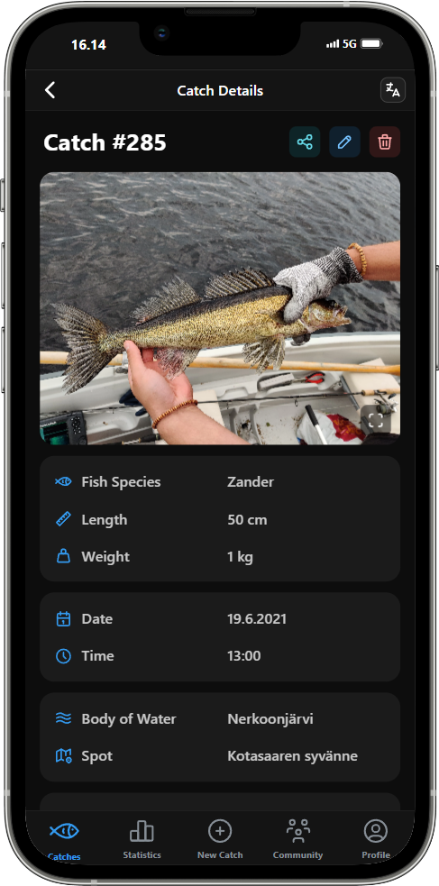
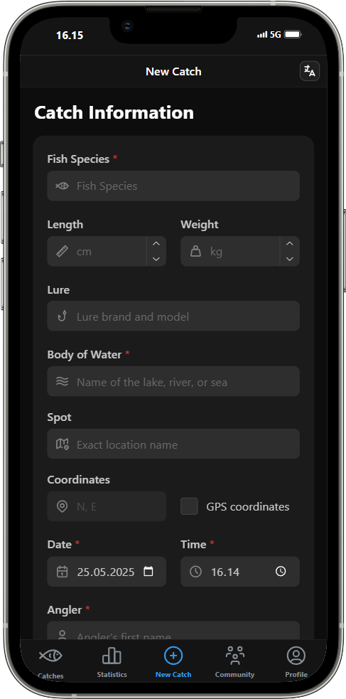

# KalaLog 🎣

**KalaLog** is a fishing diary app designed for logging, viewing, and analyzing your own and your friends' catches. 

## Key Features
- **Catch Logging**: Record details about your catches, including species, weight, length, lure used, date and time, location information and more.
- **Image Uploads**: Add photos to your catches for visual documentation.
- **Table View with Filtering and Sorting**: Easily browse your catches in an interactive table, with comprehensive filtering and sorting options.
- **Full-Screen Catch Details**: View detailed information and images of each catch in a full-screen catch details view.
- **Achievement System**: A progression system where users earn experience points and unlock various achievements based on their logged catches. 
- **Multi-Language Support**: Full support for Finnish and English. 
- **Role-Based Permissions**: Multiple user roles that control what users can access, create, edit or delete in the app.
- **Progressive Web Application (PWA)**: Installable on Android and iOS devices, allowing full-screen usage without browser menus for a native-like experience.
- **Responsive Design**: Optimized for mobile use but fully functional also on desktops.

## Technologies Used
- **Framework**: [Next.js](https://nextjs.org/) (App Router), built on [React](https://react.dev/)
- **Language**: [TypeScript](https://www.typescriptlang.org/) for type-safe development
- **UI Library**: [Mantine UI](https://mantine.dev/) for component styling and design
- **Data Table**: [AG Grid](https://www.ag-grid.com/) for interactive and customizable tables
- **Backend**: Next.js API Routes for server-side logic (powered by Node.js serverless functions)
- **Authentication**: [JSON Web Tokens](https://jwt.io/) (JWT) for authentication and role-based permissions
- **Database**: [MongoDB Atlas](https://www.mongodb.com/atlas) (cloud-hosted NoSQL database) with [Mongoose](https://mongoosejs.com/) for schema-based data modeling
- **Validation**: [Zod](https://github.com/colinhacks/zod) for runtime schema validation
- **Image Hosting**: [Cloudinary](https://cloudinary.com/) for managing uploaded images
- **Version Control & Deployment**:
  - **Version Control:** [Git](https://git-scm.com/) with code hosted on [GitHub](https://github.com/)
  - **Hosting & Deployment:** [Vercel](https://vercel.com/) – automatically deploys production builds on push to GitHub
- **Progressive Web Application ([PWA](https://developer.mozilla.org/en-US/docs/Web/Progressive_web_apps))**: Installable on Android and iOS devices, with full-screen support

## Future Improvements 
- **Interactive Statistics**: A page for analyzing catches and users with statistics like species distribution, leaderboards, time information, and top fishing spots.
- **Weather Data Integration**: Enable the possibility to link weather data to logged catches for more insights.

## Screenshots

