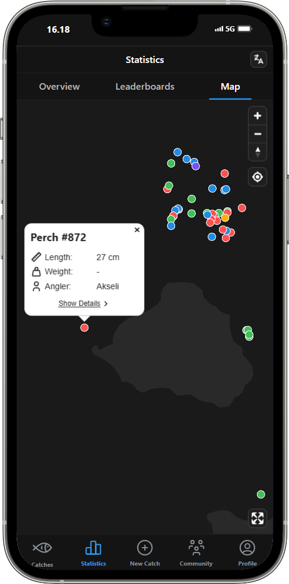
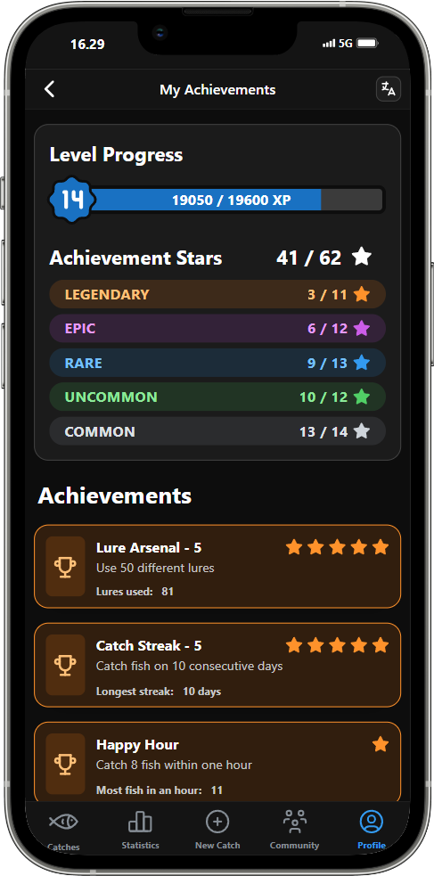

# KalaLog 🎣

**KalaLog** is a fishing diary app designed for logging, viewing, and analyzing your own and your friends' catches. 

## Key Features
- **Catch Logging**: Record details about your catches, including species, weight, length, lure used, date and time, location information and more.
- **Image Uploads**: Add photos to your catches for visual documentation.
- **Table View with Filtering and Sorting**: Easily browse your catches in an interactive table, with comprehensive filtering and sorting options.
- **Full-Screen Catch Details**: View detailed information and images of each catch in a full-screen catch details view.
- **Interactive Statistics**: A page for analyzing catches and users with statistics like species distribution and different leaderboards.
- **Embedded Map View**: Display catch location information in an interactive embedded map component.
- **Achievement System**: A progression system where users earn experience points and unlock various achievements based on their logged catches.
- **Community Features**: View other users’ profiles and create and participate in in-app fishing events.
- **Multi-Language Support**: Full support for Finnish and English. 
- **Role-Based Permissions**: Multiple user roles that control what users can access, create, edit or delete in the app.
- **Progressive Web Application (PWA)**: Installable on Android and iOS devices, allowing full-screen usage without browser menus for a native-like experience. Possibility to enable Push Notifications.
- **Responsive Design**: Optimized for mobile use but also fully functional also desktop.

## Technologies Used
- **Language**: [TypeScript](https://www.typescriptlang.org/) for type-safe development
- **Framework**: [Next.js](https://nextjs.org/) (App Router), built on [React](https://react.dev/)
- **Backend**: Next.js API Routes for server-side logic (powered by Node.js serverless functions)
- **Authentication**: [JSON Web Tokens](https://jwt.io/) (JWT) for authentication and role-based permissions
- **Database**: [MongoDB Atlas](https://www.mongodb.com/atlas) (cloud-hosted NoSQL database) with [Mongoose](https://mongoosejs.com/) for schema-based data modeling
- **Validation**: [Zod](https://github.com/colinhacks/zod) for runtime schema validation
- **Image Hosting**: [Cloudinary](https://cloudinary.com/) for soring, managing and securely serving uploaded images with signed URLs
- **Localization**: [next-intl](https://next-intl.dev/) for UI translations
- **Map Component**: [Mapbox](https://www.mapbox.com/) for visualizing catch data location information in an embedded interactive map view
- **Progressive Web Application ([PWA](https://developer.mozilla.org/en-US/docs/Web/Progressive_web_apps))**: Installable on Android and iOS devices, with full-screen support and push notifications
  - [**Serwist**](https://serwist.pages.dev/) for configuring the service worker

- **UI and Styling**: 
  - Layouts and component design with [Mantine UI](https://mantine.dev/), [CSS](https://developer.mozilla.org/en-US/docs/Web/CSS)
  - [AG Grid](https://www.ag-grid.com/) for interactive and customizable data tables
  - [Chart.js](https://www.chartjs.org/docs/latest/) for data visualization with different chart types
  - [tsParticles](https://particles.js.org/) for particle effects
  
- **Development, Testing & Deployment**:
  - **Code Quality**: [ESLint](https://eslint.org/) + [Prettier](https://prettier.io/)
  - **Testing Tools**: [Jest](https://jestjs.io/)
  - **Develompment**: [Visual Studio Code](https://code.visualstudio.com/)
  - **Task management**: [GitHub Projects](https://docs.github.com/en/issues/planning-and-tracking-with-projects/learning-about-projects/about-projects) 
  - **Version Control:** [Git](https://git-scm.com/) with code hosted on [GitHub](https://github.com/)
  - **Hosting & Deployment:** [Vercel](https://vercel.com/) – automatically deploys production builds on push to GitHub

## Future Improvements
- **Weather Data Integration**: Enable the possibility to link weather data to logged catches for more insights.

## Screenshots

